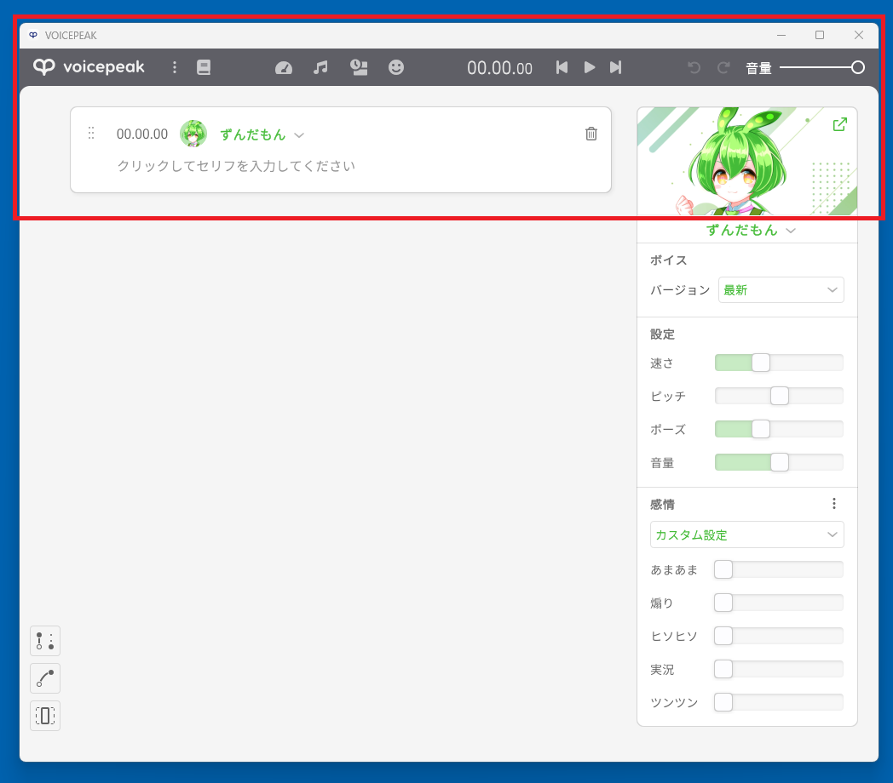

# voicepeak-connect ゆかりねっとプラグイン

voicepeak-connect のゆかりねっとプラグイン実装です。  
Win32 APIを用いて連携するので現時点でCLIより高速に動作すると思います。  
https://install.appcenter.ms/users/azumyar/apps/yukerinette-voicepeak-plugin/distribution_groups/canary

## インストール
ゆかりねっと(x64)のインストールフォルダ\Pluginsにアーカイブを解凍してでてきたyukarinette-voicepeak-connect.dllとYarukizero.Net.VoicePeakConnectフォルダをコピーしてください。

## 使用方法
1. VOICEPEAKを起動します
2. 話者の選択、トークパラメータの設定をします
3. このとき何も入力しないでください
4. ゆかりねっとを起動し「VOICEPEAK メッセージ連携」を選択します
5. 音声認識を開始すると自動的にVOICEPEAKがリサイズされますが触らないでください
6. ゆかりねっとでしゃべるとVOICEPEAKと連携されます

## 注意
赤枠の部分は見えている状態にしてください。ここを隠すと連携に失敗します。

