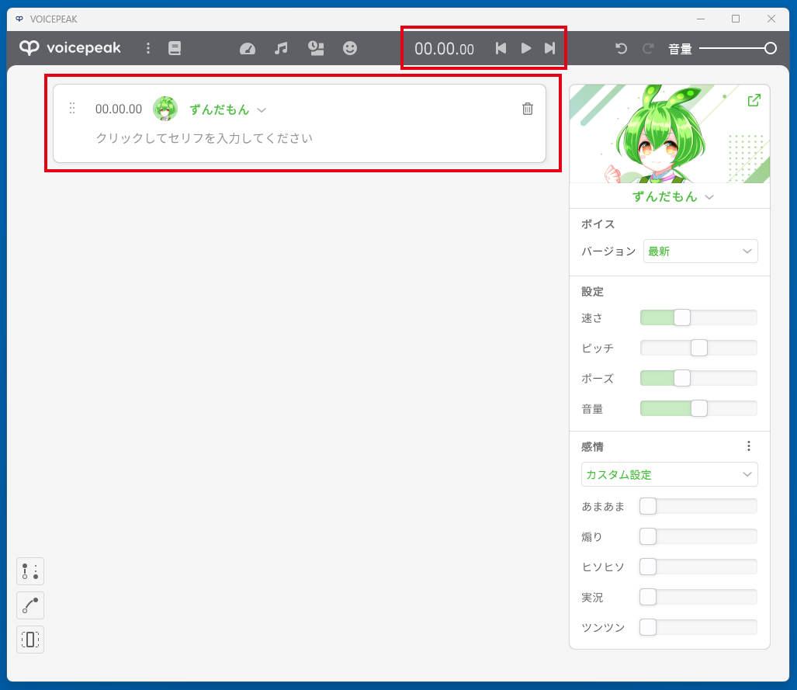

# voicepeak-connect ゆかりねっとプラグイン

voicepeak-connect のゆかりねっとプラグイン実装です。  
Win32 APIを用いて連携するので現時点でCLIより高速に動作すると思います。  
https://github.com/azumyar/voicepeak-connect/releases

## インストール
ゆかりねっと(x64)のインストールフォルダ\Pluginsにアーカイブを解凍してでてきたyukarinette-voicepeak-connect.dllとYarukizero.Net.VoicePeakConnectフォルダをコピーしてください。

## 使用方法
1. VOICEPEAKを起動します
2. 話者の選択、トークパラメータの設定をします
3. このとき何も入力しないでください
4. ゆかりねっとを起動し「VOICEPEAK メッセージ連携」を選択します
5. 音声認識を開始すると自動的にVOICEPEAKがリサイズされますが触らないでください
6. ゆかりねっとでしゃべるとVOICEPEAKと連携されます

## 設定ファイル
標準で50秒で読み上げを打ち切るようになっています。この設定はiniファイルYarukizero.Net.VoicePeakConnect\voicepeak-connet.iniにより連携デッドロック防止時間が制御できます。設定画面は作っていません。また標準のゆかりねっとインストールでは管理者権限がないとこのファイルを編集できないので必要な場合事前に設定しておいてください。  
デッドロック防止は外部プロセスと連携するため意図しない動きをした場合ゆかりねっとがフリーズするのを防止するために設けられています。読ませたい長文との兼ね合いで設定してください。

## 注意
赤枠の部分は見えている状態にしてください。ここを隠すと連携に失敗します。   
  
